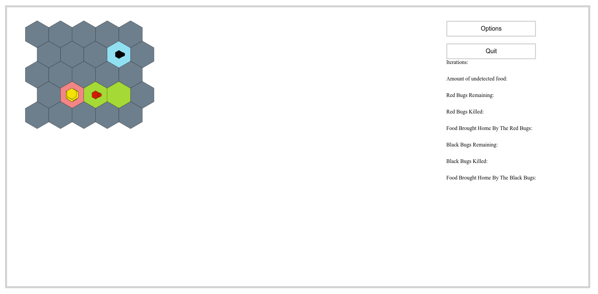

## How to deploy and test

It is wil be deployed on Clamv: https://clabsql.clamv.jacobs-university.de/~mbudnikov/, and tests at https://clabsql.clamv.jacobs-university.de/~mbudnikov/test/test.html.

For local testing we use `light-server` module (simply to serve static files), because it’s easier then full-fledged server
side solutions.

To install it you can use npm:
```
sudo npm install -g light-server
```

And then run: 
```
light-server -s . -b localhost
```

Now the site should be available at http://localhost:4000, and tests are at http://localhost:4000/test/test.html.

Note that sample files for world maps are available in `tests/sampleMaps` and for programs in `tests/samplePrograms`.

## Technologies used
Mostly it is raw JavaScript, with the only exceptions being:
- [Mocha](https://mochajs.org/): unit testing
- [Chai](https://www.chaijs.com/): assertions

## File structure
```
.
├── GUI
│   ├── page.js
│   └── render.js
├── index.html
├── logic
│   ├── BugBrain.js
│   ├── Bug.js
│   ├── CellCondition.js
│   ├── checks.js
│   ├── Color.js
│   ├── Engine.js
│   ├── instructions.js
│   ├── Position.js
│   ├── WorldCell.js
│   └── World.js
├── README.md
├── style.css
└── test
    ├── sampleMaps
    │   ├── 711map.txt
    │   ├── 712map.txt
    │   ├── 713map.txt
    │   ├── 714map.txt
    │   ├── illegalVal.txt
    │   ├── noBorder.txt
    │   ├── notConnected.txt
    │   ├── ok1.txt
    │   ├── ok2.txt
    │   ├── ok3.txt
    │   ├── oneNestOnly.txt
    │   └── tooManyLines.txt
    ├── samplePrograms
    │   ├── collect.txt
    │   └── simple.txt
    ├── test.html
    └── test.js
```
## Preview


## Sprint 3

### Progress
- These are based on our previous sprints
    - Set up a linter to ensure a stable codestyle
    - Set up testing with Mocha and Chai
    - GUI
        - Hexagonal grid for the map
        - Rendering free / blocked cells and the amount of food there
        - Rendering base cells
        - Rendering bugs with their directions and food
    - `WordCell` class with tests
    - `World` class with tests
    - `Bug` class with tests
    - `Color` and `CellCondition` enumerations, also covered in tests
    - `Position` class, covered in tests
    - `BugBrain` class, partially implemented
    - More thorough world checks, including connectivity
    - Sample maps with many corner cases
- Removed inline JS listeners and rewrote code from scripts to modules
- Refactored completely unreadable `assemble` into multiple functions with smaller responsibilities
- Connected file loaders from this code base to the GUI from the old one
- Classes for instructions, covered in tests
- Serialization and deserialization for them with tests
- `Engine` class with tests
- Connected it to GUI, now simulation is working
- Processing instructions, tests for the most important ones
- Implemented program parsing, covered with tests

## Previous progress
In this sprint we made the general GUI and got all button connections working. 

The user starts by pressing the 'Click here to start!' button 


This will bring them to the 'Upload page' where the user can upload files, however, currently the only file upload that makes 
a difference is the chosen map file (map.txt). When uploading this file, the 'Main Page' will only show the map in its .txt state
without the dimensions at the top. If one of the other map files is selected (711map.txt,712map.txt,713map.txt,714map.txt) the 
errors with these map files will be caught and the user will receive an alert and will not be brought to the 'Main Page'. 
The maps are named with respect to the error they contain as specified in "Specifications_Standard.pdf". The 'Upload' button
will give the user an alert if no map file was uploaded. Checking the log box will show a message 'Logs will be here' on the 
'Main page' since currently no actual simulation exists there is only a placeholder.


Similarly, all other visible features on the 
'Main page' are currently represented with a placeholder. In the Options page accessible via the 'Options' button in the 'Main page' 
we decided to exclude two options from the 'Specifications Standard.pdf' that allowed for changing the color of bug teams. The reason 
for this is further explained in the comment in 'Page.html' on lines 128-132. 


The 'Specification Standard.pdf' also mentioned there 
should be a 'Quit?' page asking if the user really wants to quit. We decided to replace this page with a confirmation alert that 
appears when the 'Quit' button is pressed on the 'Main page'. Pressing 'OK' from the confirmation alert will bring the user to the 
'Ending' page which only has a 'Restart' button which will bring the user back to the beginning.


